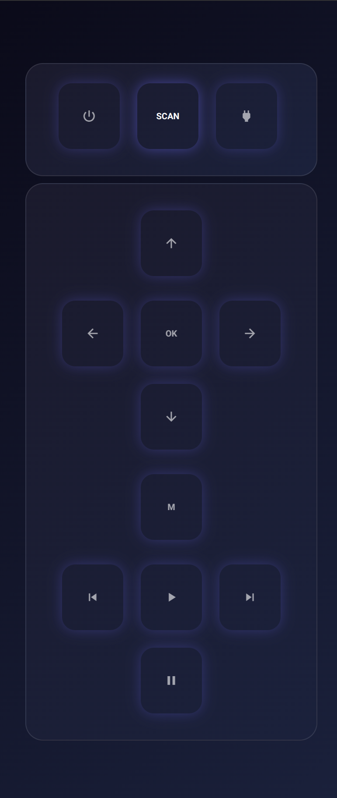

# Iris

## Intro

- This is an AppleTV Remote App.
- This is the web version of the front end for iris. It ties in with `../backend`.

## How to run

- node version 20+
- Start the backend first (`../backend`, listening on port 8080). The dev server forwards `/api` to it.
- `npm install`
- `npm run dev`

In production the backend serves the built app (`npm run build` → `dist/spa`), so the page and API share one address. From the repo root, `make run` does both.

## How it looks

